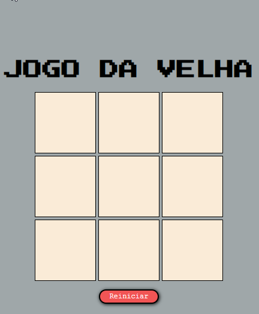

# JOGO DA VELHA (PG-Br)
## Projeto (finalizado :white_check_mark:)

Projeto desenvolvido durante módulo de curso de Desenvolvedor Front-End do curso <strong>Programador BR</strong>.

Visa a experiência de construção de um "jogo da velha" simples sem utilização de bibliotecas. 

## 🛠️ Recursos

* HTML
* CSS
* Javascript

## 💻 Demonstração

  

## 🌐 Site

<https://hebert-santana.github.io/js-jogodavelha/>

## Autor
~~~ javascript
Hebert Santana
~~~

