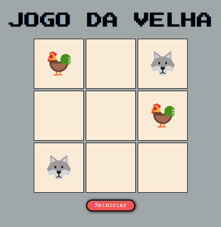

Módulo do Curso de Desenvolvedor Front-End do site https://programadorbr.com/.

Visa a experiência de construção de um "jogo da velha" simples sem utilização de bibliotecas. 

Com esse projeto coloquei em prática alguns conceitos de HTML5, CSS e JavaScript.

https://hebert-santana.github.io/jogo-da-velha/

<h1>Demonstração</h1>

